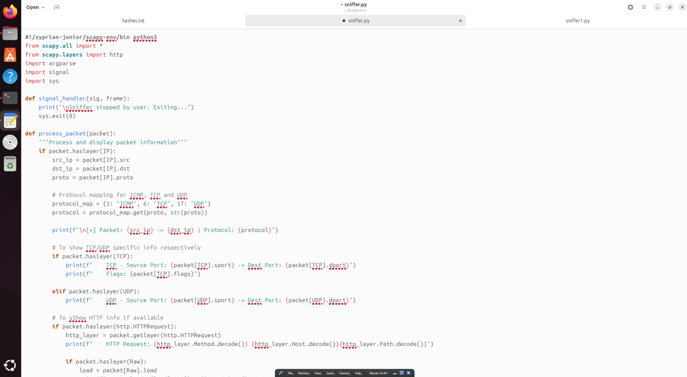
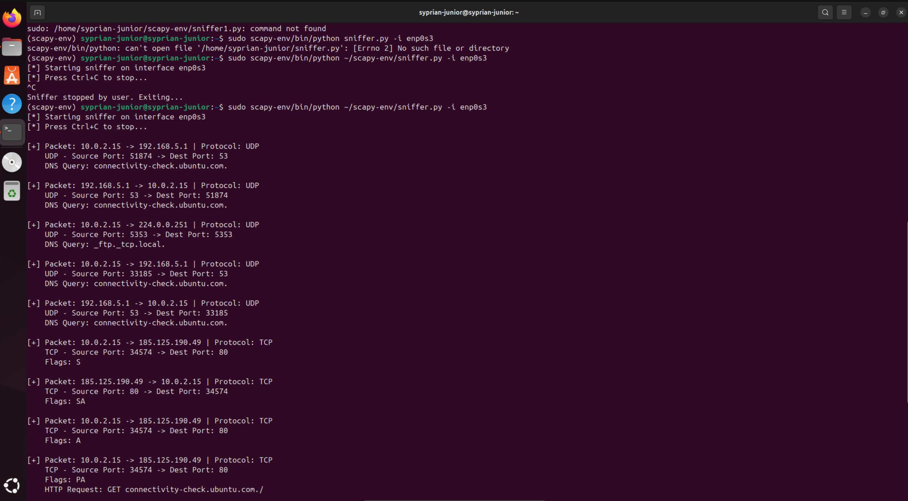

# CodeAlpha_BasicNetworkSniffer

# 🛡️ Basic Network Packet Sniffer

This project is a Python-based network packet sniffer built using [Scapy](https://scapy.net/). It captures and analyzes live packets on a specified network interface, providing details like source/destination IPs, protocol type, ports, HTTP requests, DNS queries, and more.

---

## 📌 Features

- Capture packets in real-time
- Decode protocols: IP, TCP, UDP, ICMP, HTTP, DNS
- Display payloads from HTTP requests
- Command-line interface to choose interface and packet count
- Graceful exit with Ctrl+C

---

## 🚀 Requirements

- Python 3.6+
- Scapy

Install dependencies in a virtual environment:
---

See the [sniffer.py](sniffer.py) file for the full code.




---



```bash
python3 -m venv scapy-env
source scapy-env/bin/activate
pip install scapy
